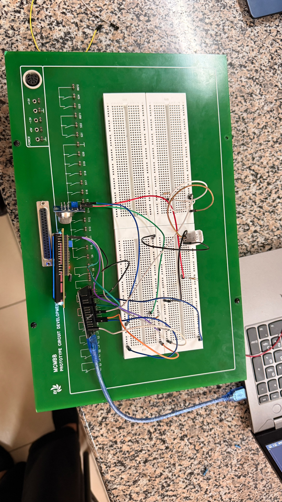
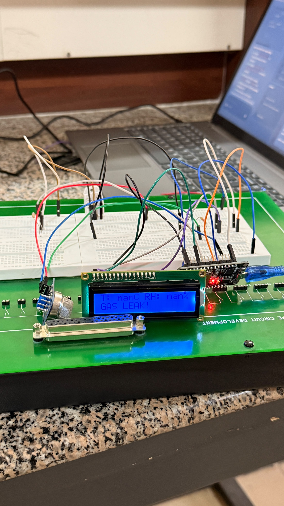
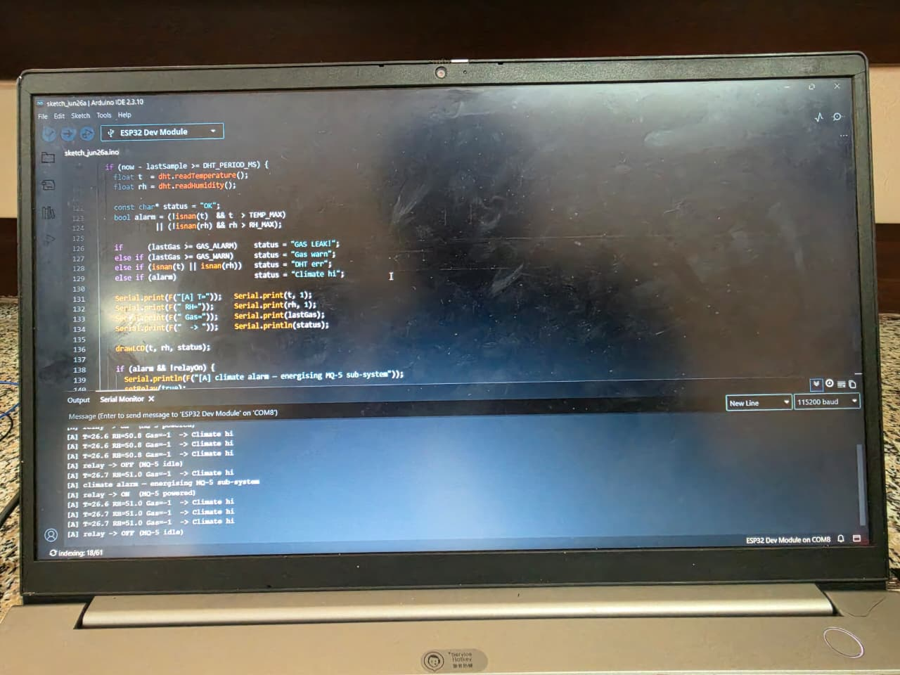
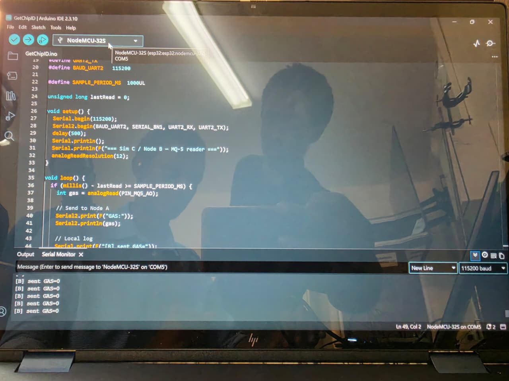
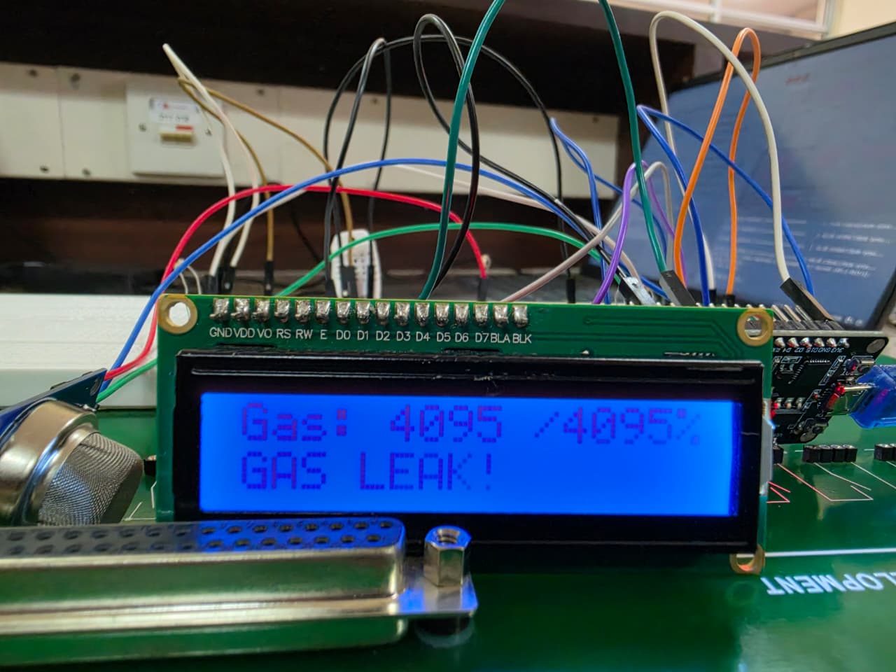
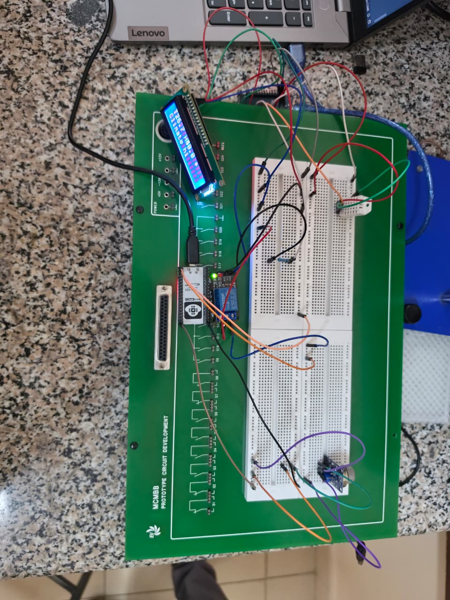
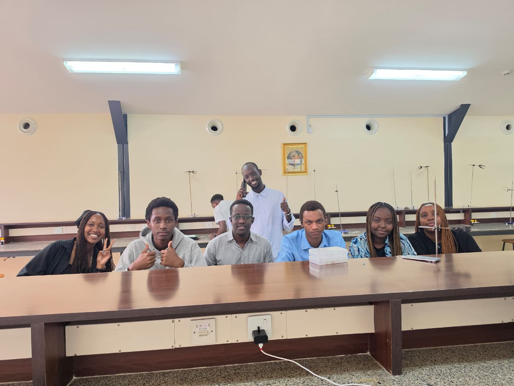

# ICS 4111: Semester Project, Deliverable 2

**Course:** ICS 4111 · Embedded Systems & IoT (Apr–Jul 2026)

**Use case:** Flora Farms, Naivasha. Remote greenhouse monitoring.

**Assigned flower:** **Tulips** (*Tulipa* spp.)

**Date:** 2026-06-24

---
**Group Members:**
* 158657	Kuria Shawn James
* 165948	Murage Charles
* 166095	Munyiri Timothy
* 160761	Muriuki Nelly Nkatha
* 168669	Riang'a Ravine Kerubo
* 167022	Billy John Igiraneza
* 168661	Diang'a Erika Abuchie

## 1. Overview

This deliverable builds working prototypes (physical and simulated) for the three architectures specified in Deliverable 1:

- Architecture **(a)** (*single ESP32 + DHT22 + MQ-5 + display*) is delivered as both a physical build and a Wokwi simulation.
- Architecture **(b)** (*two ESP32s communicating via UART*) is delivered as a simulation only (Wokwi).
- Architecture **(c)** (*two ESP32s with DHT22 node gating MQ-5 node via a relay*) is delivered as a physical build.

---

## 2. Wokwi simulations

### 2.1 Simulation A: single ESP32 + DHT22 + MQ-5 + OLED

- **Wokwi link:** <https://wokwi.com/projects/467698884445775873>
- **Sketch:** displays temperature, humidity, gas reading and a status banner on the OLED, and prints to Serial at 115200 baud.
- **How to demo:** drag the potentiometer knob and the OLED status flips from `OK` to `Gas warn` (ADC > 1500) and `GAS LEAK!` (ADC > 2800). Adjust the DHT22 panel values to push T or RH outside the tulip-safe band and watch the status change.
- **Expected output:**
  - OLED: 4-line readout with header, status, T, RH, Gas.
  - Serial: `T=21.0 C  RH=65.0 %  GAS=1450  -> OK`

### 2.2 Simulation B: two ESP32s talking UART2

Wokwi runs one firmware binary per project, so we published Node 1 and Node 2 as two independent public projects. Each project holds only its own ESP32 and sensor; the physical UART link and shared GND that connect the boards on real hardware are documented in the Deliverable 1 schematic.

- **Wokwi link (Node 1, MQ-5 sender):** <https://wokwi.com/projects/468265550519854081>
- **Wokwi link (Node 2, DHT22 receiver with LCD):** <https://wokwi.com/projects/468265847344499713>

**Expected output**

- Node 1 Serial Monitor: `[MQ-5 node] TX -> G:1450   ok` (or `** GAS ALERT **` above 2000 mV).
- Node 2 Serial Monitor: `[DHT22 node] T=21.0 RH=65.0 | RX gas=1450 mV  ok`.
- Node 2 LCD: T/RH on line 1, `Gas:1450mV ok` (or `ALRT`).

---

## 3. Physical prototypes

### 3.1 Physical (a): single ESP32 + DHT22 + MQ-5 + I²C LCD

A single ESP32-S DevKit V1 reads the DHT22 (GPIO4, 15 kΩ pull-up), the MQ-5 (GPIO34, via a 15 kΩ / 22 kΩ voltage divider), and drives a 16×2 I²C character LCD (GPIO21/22) at address 0x27. Same firmware logic as the Wokwi simulation.

- **Photographs:** 
- **LCD output:** 

### 3.2 Physical (c): DHT22 node gates MQ-5 node through a relay

Two ESP32 DevKits implement the relay-gated architecture from Schematic C. Node A reads the DHT22, drives the I²C LCD, and controls a low-level-trigger 5 V relay on GPIO5 (through a 1 kΩ current-limit resistor). Node B reads the MQ-5 on GPIO34 and streams `GAS:nnnn\n`.

For development we kept both boards on USB power so both Serial Monitors could be viewed.

**Photographs:**

- **Node A IDE / Serial Monitor:** 
- **Node B IDE / Serial Monitor:** 
- **LCD on Node A showing live readings:** 
- **Physical breadboard build (both nodes):** 

## 4. Known issues and limitations (physical prototypes)

**Display substitution: I²C LCD instead of 1.3" OLED**

Our Deliverable 1 BOM lists a 1.3" SH1106 OLED for both physical architectures (a) and (c), but the team did not have one on hand at build time. We substituted a **16×2 I²C character LCD** (PCF8574 backpack at 0x27) for both builds. The replacement shows the same temperature, humidity, gas reading and status text.

---

## 5. Evidence of group work

---
