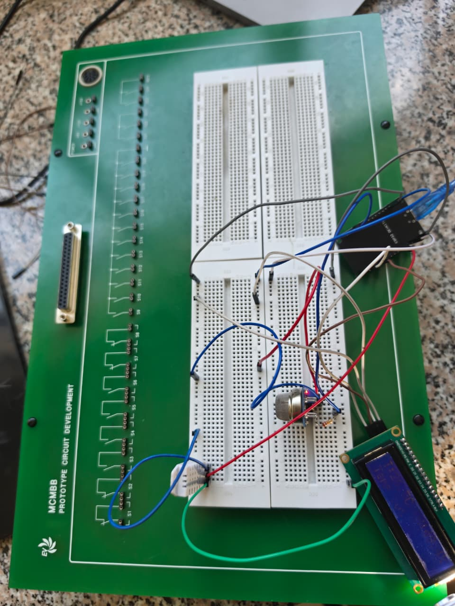
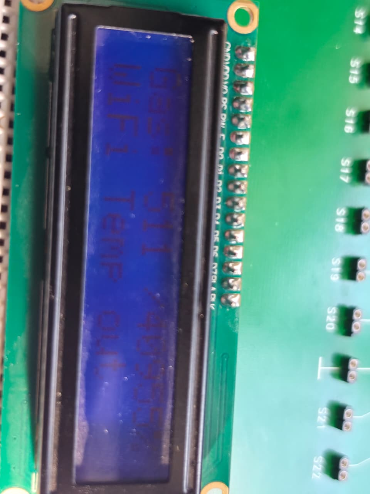
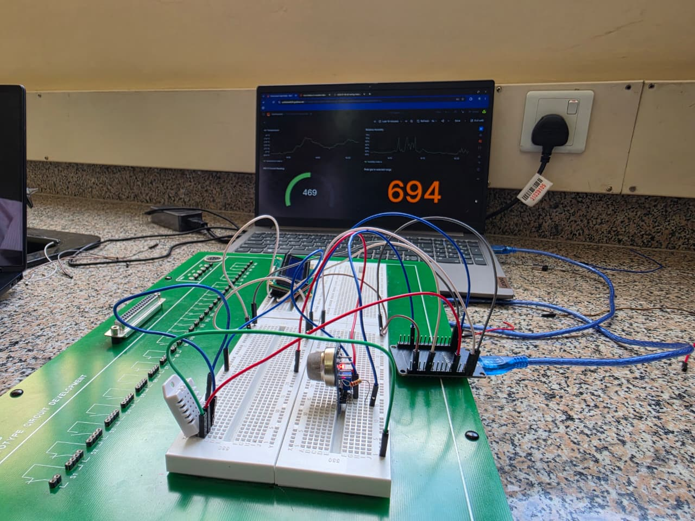
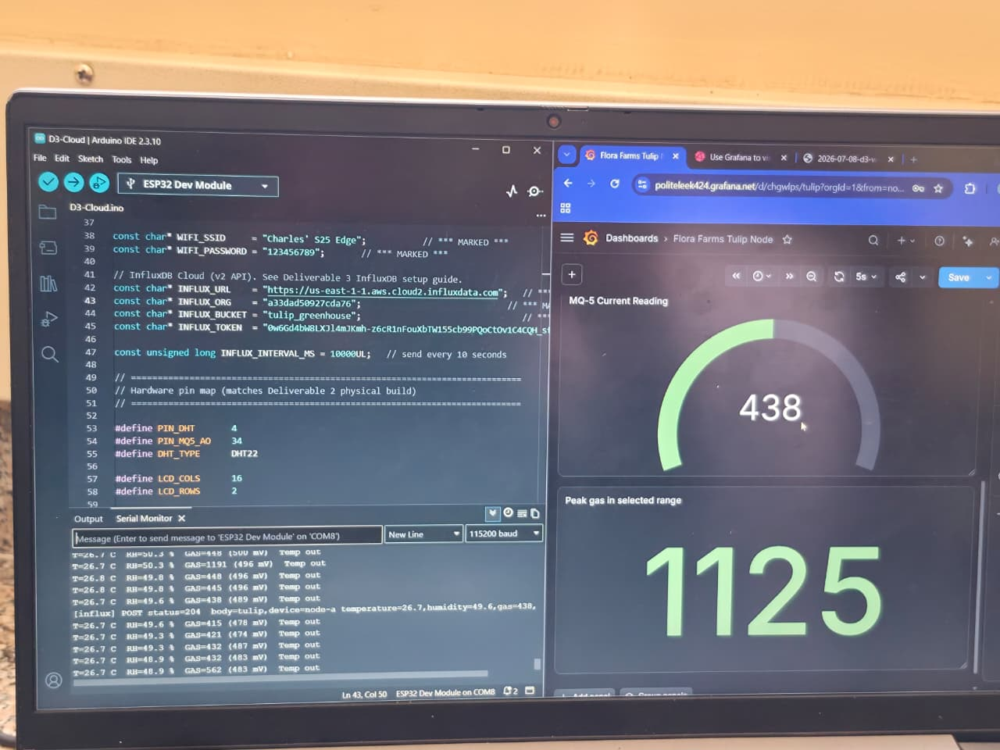
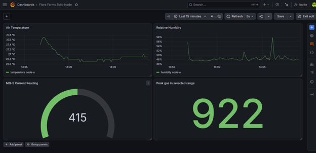
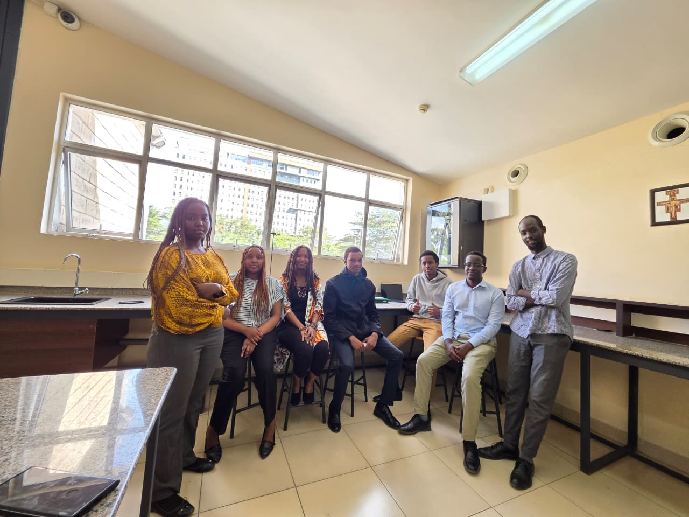

# ICS 4111: Semester Project, Deliverable 3

**Course:** ICS 4111 · Embedded Systems & IoT (Apr–Jul 2026)
**Client / Use case:** Flora Farms, Naivasha. Remote greenhouse monitoring.
**Assigned flower:** **Tulips** (*Tulipa* spp.)
**Date:** 2026-07-08

---
**Group Members:**
* 158657	Kuria Shawn James
* 165948	Murage Charles
* 166096	Munyiri Timothy
* 160761	Muriuki Nelly Nkatha
* 168669	Riang'a Ravine Kerubo
* 167022	Billy John Igiraneza
* 168661	Diang'a Erika Abuchie

## 1. Overview

This deliverable extends the Deliverable 2 Sim A prototype (ESP32 + DHT22 + MQ-5 + LCD) with WiFi connectivity, pushes sensor readings to **InfluxDB Cloud** every 10 seconds, and visualises them on a **Grafana Cloud** dashboard with four panels.

---

## 2. Physical prototype

**Photographs:**

- **Physical build (top-down view):** 

- **LCD showing live readings:** 

- **Full setup with dashboard visible on laptop:** 

- **Arduino IDE Serial Monitor beside Grafana dashboard:** 

---

## 3. Cloud platforms

- **Public dashboard snapshot:** <https://politeleek424.grafana.net/dashboard/snapshot/s41z7x8Cjvy9jfReStWWjvap50hjZyZu>
- **Dashboard screenshot:** 

    

---

## . Evidence of group work

---

